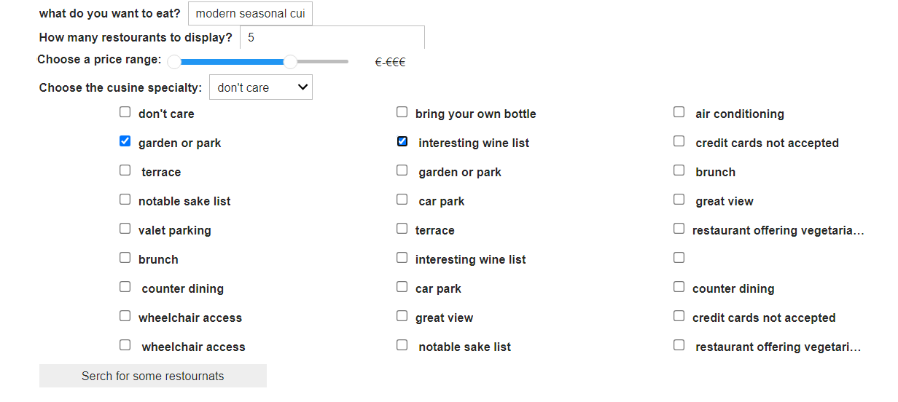
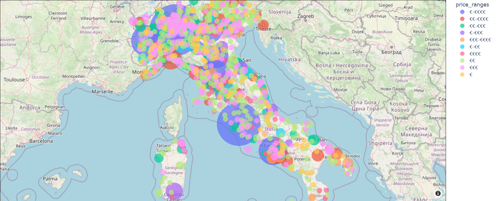
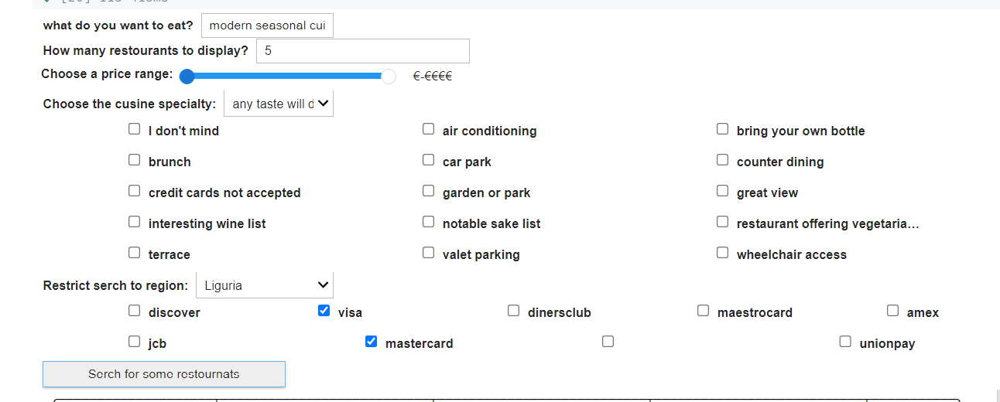

# ***ADM-HW3***  

## Group 21 members
1. Nurbek Khalmatay, 2184569, khalmatay.2184569@studenti.uniroma1.it
2. Francesco de Martino, 1908303 demartino.1908303@studenti.uniroma1.it
3. Giacomo Finocchi Ghersi, 1918400
finocchighersi.1918400@studenti.uniroma1.it
---


Welcome to the **ADM-HW3** project! This repository contains the solution to the Homework 3 assignment for the ADM course at Sapienza University of Rome. The main goal of this homework is to create a search engine for the **2025 list of Michelin restaurants**.  

---
## Note to TA's and reviewers!!!
Here is the link to nbviewer. It doesn't show the UI search Engine [main.ipynb](https://nbviewer.org/github/khalmatay/ADM-HW3/blob/main/main.ipynb)


---

## 🔍 **Overview**

In this homework, we designed a search engine to explore and analyze the 2025 Michelin restaurants dataset. The project includes the necessary files and code implementations to address the assigned questions and complete the tasks effectively.  

--- 


## 📂 **Files and Resources**

1. **`main.ipynb`**  
   This notebook contains the complete solution to the questions and tasks assigned in this homework.  
   You can find the notebook here:  
   [GitHub Repository](https://github.com/Sapienza-University-Rome/ADM/tree/master/2024/Homework_3)  

2. **Resources and Data**  
   All downloaded and generated files for this project are available in the following Google Drive folder:  
   [Google Drive Folder](https://drive.google.com/drive/folders/1rRZ-I2nrcCurl0CJufRs6lONLLtKO56T?hl=it)  
```
├── data/
│   ├── page/
│         └── restaurant_1.html
├── restaurant_urls.txt         # List of restaurant URLs for crawling
├── restaurants_i.tsv           # Restaurant dataset (intermediate format)  
├── italy_cities_regions.tsv    # List of cities, regions, coordinats    
├── vocabulary.csv
```
3. **Structure**
Below is the structure of the project directory:

```plaintext
ADM-HW3/

├── .gitignore                  # Files to be ignored by Git
├── LICENSE                     # Project license information
├── crawler.py                  # Web crawler for fetching data
├── engine.py                   # Search engine implementation
├── functions.py                # Helper functions
├── geocode_restaurants.py      # Script for geocoding restaurant data
├── loader.py                   # HTML load 
├── main.ipynb                  # Jupyter notebook with homework solutions
├── parser.py                   # Data parsing and preprocessing
├── README.md                   # Project README file
├── requirements.txt            # Required Python libraries

````

---

## 📖 **How to Use**

1. Clone the repository to your local machine using:  
   ```bash
   git clone https://github.com/khalmatay/ADM-HW3.git
   ```
   
2. Install Dependencies

```bash
   export env_name="ADM-HW3"
   
   conda create -n $env_name python=3.10
   
   conda activate $env_name
   
   conda install --file requirements.txt
```

1.1. Get the list of restaurants

Use ```python crawler.py``` to fetch the list of Michelin restaurants from the 2025 Michelin Guide.
Ensure the URLs are stored in restaurant_urls.txt for further processing.

Description of crawler.py:

Fetches HTML content from the Michelin Guide website.
Extracts and processes restaurant URLs up to the last available page.
Saves the unique URLs to a text file for further processing.

1.2. Crawl restaurants

Run ```python loader.py``` to download 1983 html pages:

Description of loader.py:

Efficiently handles parallel downloads to speed up the crawling process.
Ensures data integrity and logs the progress of each download.

1.3 Parse downloaded pages
```python parser.py```

This script parses the HTML content of each restaurant page and extracts detailed information (e.g., name, location, cuisine type).
The parsed data is saved in a structured format (restaurants_i.tsv).

At this point, you should have all the HTML documents about the restaurants of interest, and you can start to extract the restaurant information. The list of information we desire for each restaurant and their format is the following:

1. **Restaurant Name** (to save as `restaurantName`): String  
   The full name of the restaurant.

2. **Address** (to save as `address`): String  
   The street address of the restaurant.

3. **City** (to save as `city`): String  
   The city where the restaurant is located.

4. **Postal Code** (to save as `postalCode`): String  
   The postal/ZIP code of the restaurant's location.

5. **Country** (to save as `country`): String  
   The country where the restaurant operates.

6. **Price Range** (to save as `priceRange`): String  
   The price range of the restaurant's menu.

7. **Cuisine Type** (to save as `cuisineType`): String  
   The type of cuisine served at the restaurant.

8. **Description** (to save as `description`): String  
   A short description or summary about the restaurant.

9. **Facilities and Services** (to save as `facilitiesServices`): List of strings  
   A list of the facilities and services available at the restaurant.

10. **Credit Cards** (to save as `creditCards`): List of strings  
    Accepted credit card types (e.g., Visa, Mastercard).

11. **Phone Number** (to save as `phoneNumber`): String  
    The contact phone number of the restaurant.

12. **Website** (to save as `website`): String  
    The website URL of the restaurant.

## **Search Engine** 
### UI input

### Output dataframe


## **Map** 


## **BONUS: Advanced Search Engine** 



